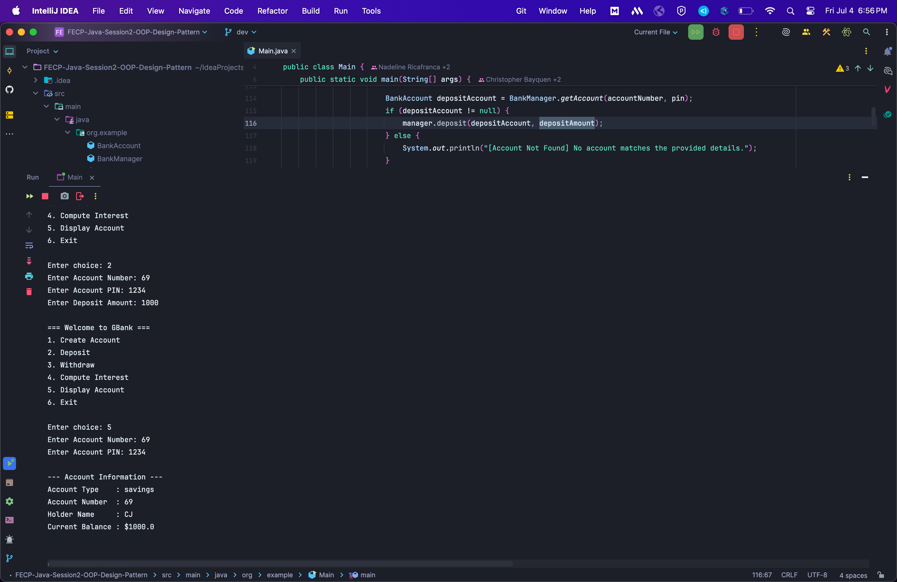
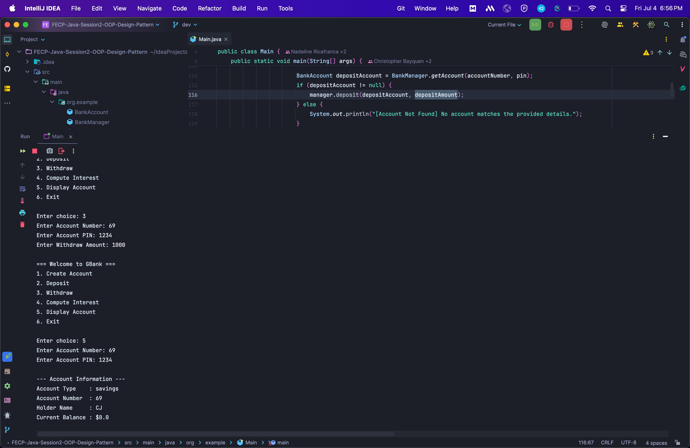
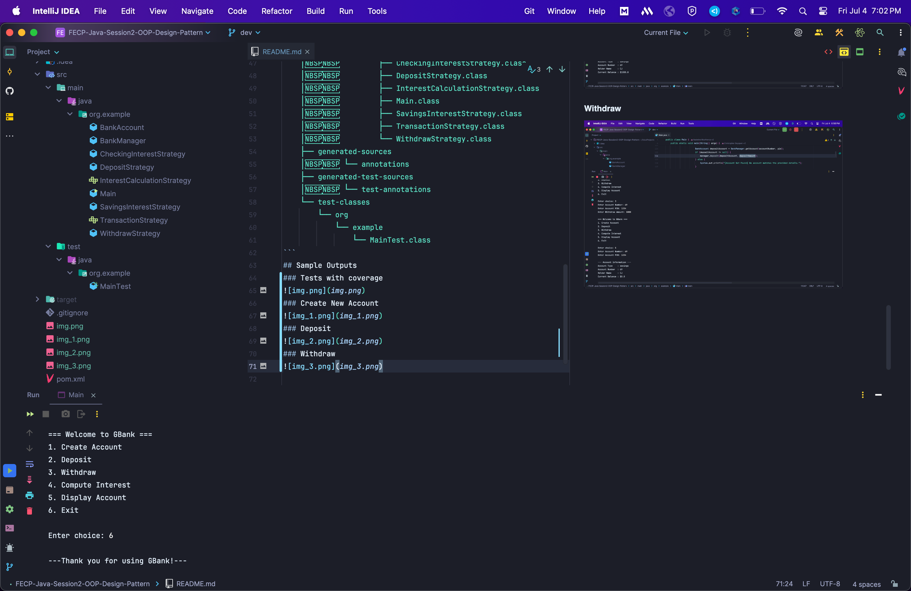
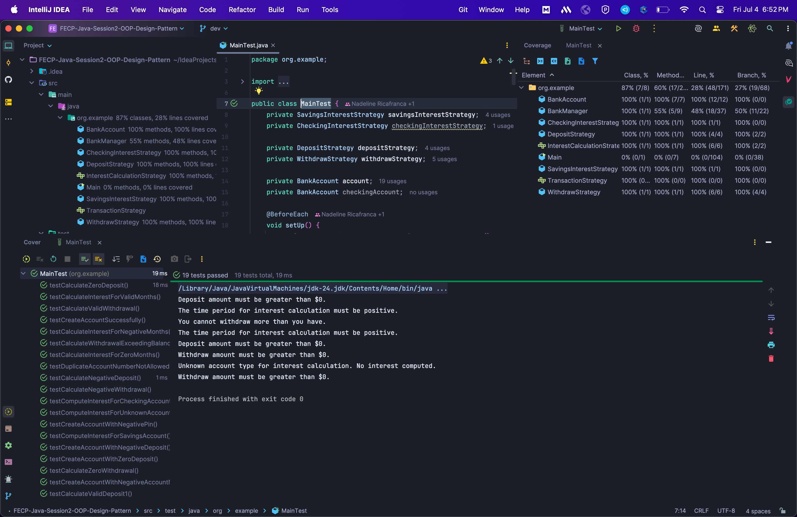

BMR
Bayquen, Christopher Gilbert<br>
Maximo, Calvin James<br>
Ricafranca, Nadeline

## GBank Banking System
This is a program that simulates a banking system by implementing the following features: 
* Creating new accounts
* Depositing money from accounts
* Withdrawing money from accounts
* Computing interest after a given number of months, and displaying the information of all existing accounts in the system.

It also adds a layer of security by requesting for both the account number and PIN whenever performing transactions.

## Project Structure
```
.
├── README.md
├── pom.xml
├── src
│   ├── main
│   │   └── java
│   │       └── org
│   │           └── example
│   │               ├── BankAccount.java
│   │               ├── BankManager.java
│   │               ├── CheckingInterestStrategy.java
│   │               ├── DepositStrategy.java
│   │               ├── InterestCalculationStrategy.java
│   │               ├── Main.java
│   │               ├── SavingsInterestStrategy.java
│   │               ├── TransactionStrategy.java
│   │               └── WithdrawStrategy.java
│   └── test
│       └── java
│           └── org
│               └── example
│                   ├── BankManagerTest.java
│                   ├── InterestCalculationStrategyTest.java
│                   └── MainTest.java
└── target
    ├── classes
    │   └── org
    │       └── example
    │           ├── BankAccount.class
    │           ├── BankManager.class
    │           ├── CheckingInterestStrategy.class
    │           ├── DepositStrategy.class
    │           ├── InterestCalculationStrategy.class
    │           ├── Main.class
    │           ├── SavingsInterestStrategy.class
    │           ├── TransactionStrategy.class
    │           └── WithdrawStrategy.class
    ├── generated-sources
    │   └── annotations
    ├── generated-test-sources
    │   └── test-annotations
    └── test-classes
        └── org
            └── example
                └── MainTest.class
```
## Sample Outputs
### Create New Account

### Deposit

### Withdraw

### Exit

## Tests with coverage

